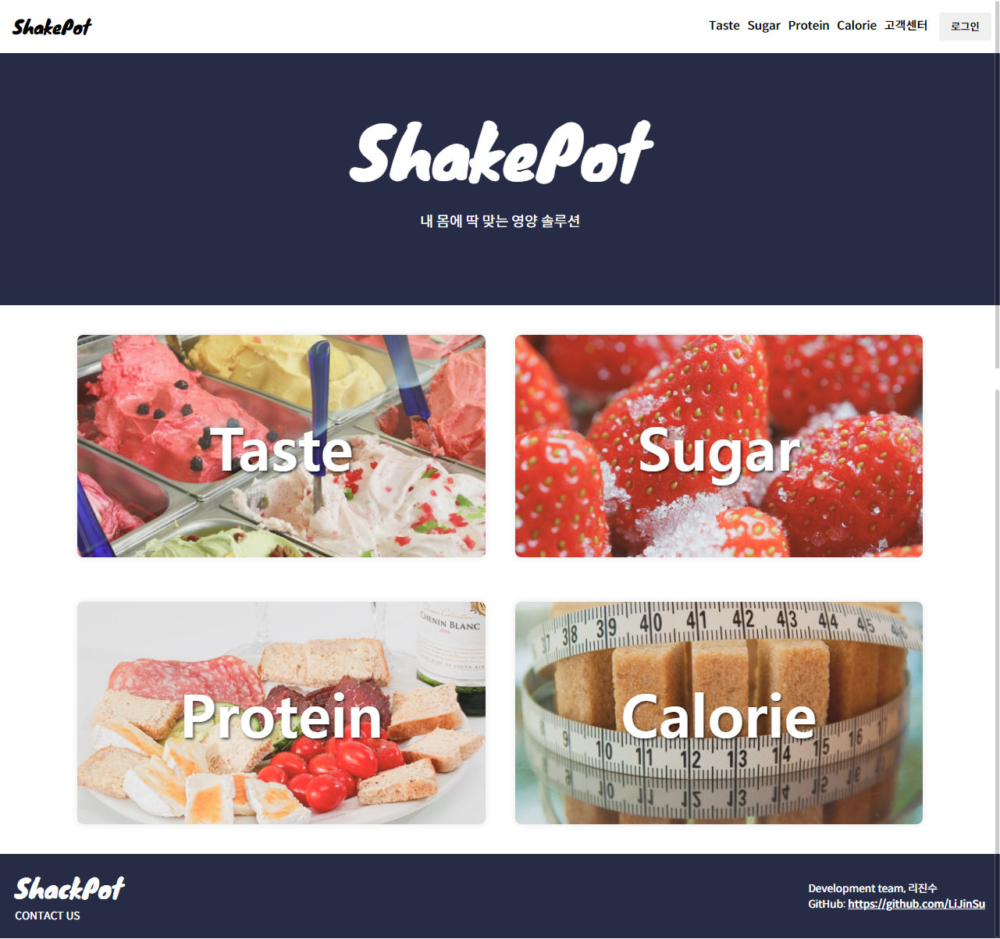
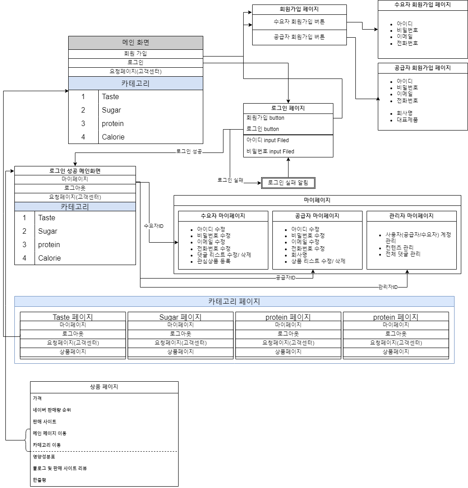
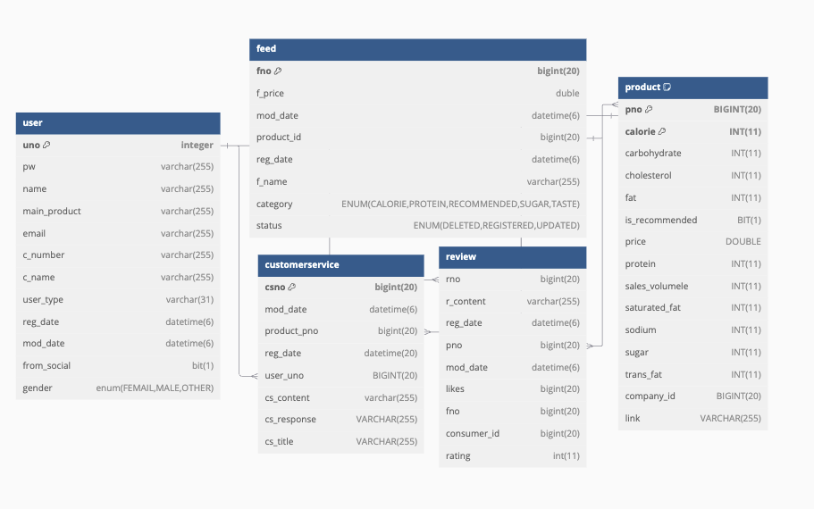
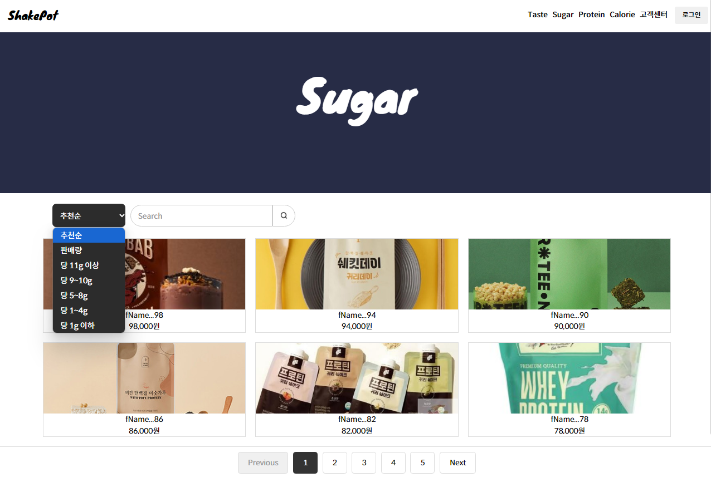
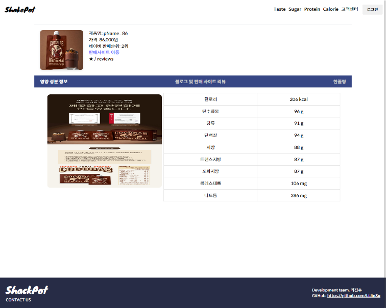
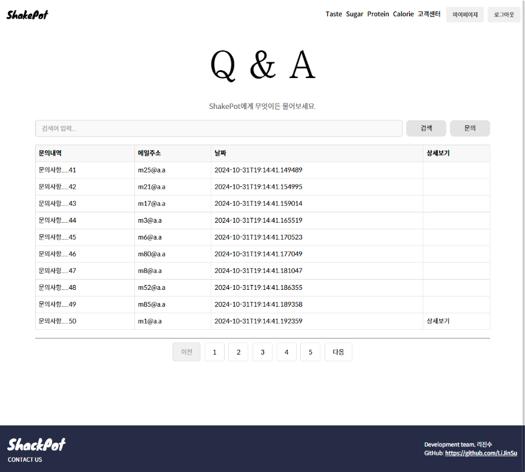
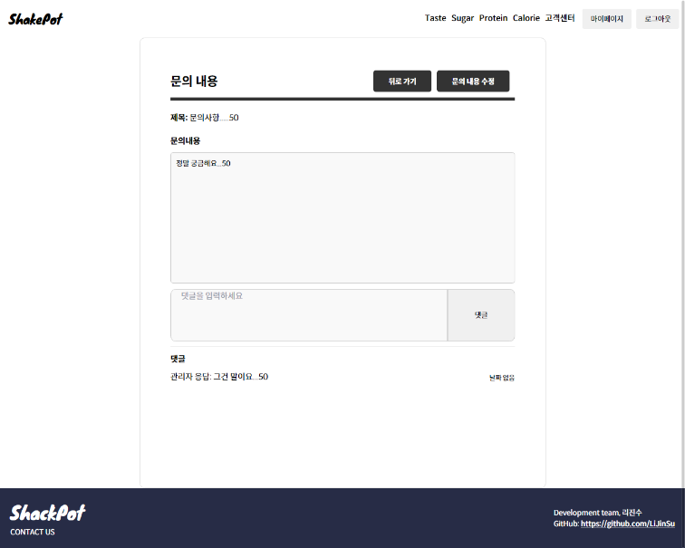
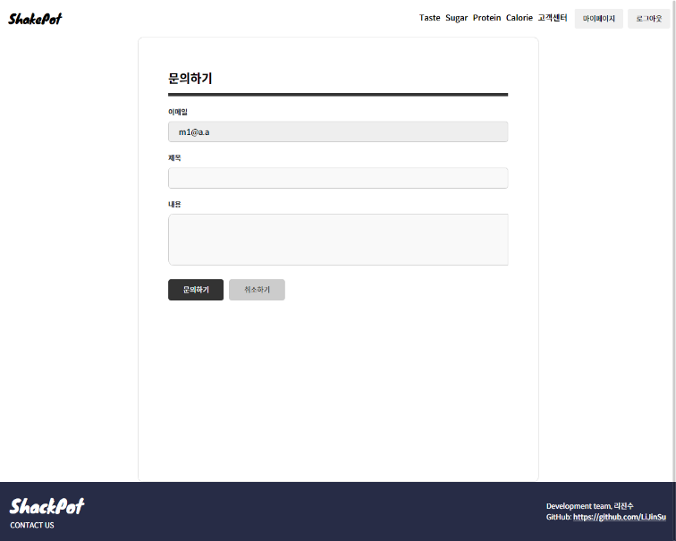

# 🥤 Team ShakePot

> **내 몸에 딱 맞는 영양 솔루션**  
> 단백질 쉐이크에 대한 포괄적인 정보 제공 플랫폼 (Team Project)  
> 사용자와 공급자 간의 중간 다리 역할을 수행하는 웹 기반 서비스  


## 📅 개발 기간
- 2024.10.03 ~ 2024.11

## ⚙️ 개발 환경
- **Backend**: Spring Boot, Spring Security, Maven  
- **Frontend**: React, styled-components  
- **Database**: MySQL, MariaDB  
- **Tools**: Figma, IntelliJ, VSCode  
- **Team Size**: 3명  

## 👨‍💻 본인 담당 역할
- Spring Boot 기반 **서버 개발 및 API 설계**  
- React 기반 **UI/UX 구현** (메인·Taste·Sugar·Protein·Calorie 페이지)  
- **고객센터(Q&A) 관리** (등록·수정·조회 기능 / 사용자 권한 제어 적용)  
- **상품 데이터 API 연동** 및 조건별 필터링 기능 구현  
- **페이징 처리**로 대량 데이터 효율적 표시  
- **JWT 인증 및 권한 관리** (Admin, User, Consumer, Company 권한별 접근 제어)  
- **동적 Header 구성**: 로그인 여부에 따른 메뉴 표시 (로그인/로그아웃/마이페이지)  

## 📂 프로젝트 화면

<table>
  <tr>
    <td align="center"><b>메인 화면</b><br></td>
    <td align="center"><b>서비스 플로우</b><br></td>
    <td align="center"><b>데이터베이스 ERD</b><br></td>
  </tr>
  <tr>
    <td align="center"><b>카테고리 페이지</b><br></td>
    <td align="center"><b>상품 목록 (Sugar)</b><br></td>
    <td align="center"><b>상품 상세</b><br></td>
  </tr>
  <tr>
    <td align="center"><b>Q&A 목록</b><br></td>
    <td align="center"><b>Q&A 상세</b><br></td>
    <td align="center"><b>Q&A 작성</b><br></td>
  </tr>
</table>

## ⚙️ Backend (Spring Boot)

### 📌 본인 담당 기능
- **회원 인증/인가 (JWT)**: 로그인 시 JWT 발급 및 권한(Role: Admin, Consumer, Company)별 접근 제어  
- **회원가입 로직 분리**: Consumer / Company 회원가입 시 DTO 변환 후 서비스 계층 처리  
- **고객센터(Q&A) 기능 개발**: 문의 등록/수정/삭제, 사용자별/제품별 조회, 권한 검증  
- **상품 데이터 API 연동**: 칼로리/당/단백질/맛 기준 조건 필터링, 페이징 처리  
- **API 응답 설계**: 프론트엔드와 연동을 고려한 DTO·ResponseEntity 구조 설계  

### 📌 코드 예시

#### JWT 로그인 처리
```java
@PostMapping("/login")
public ResponseEntity<Map<String, Object>> login(@RequestParam String email, @RequestParam String pw) {
    try {
        UserDTO userDTO = userService.loginCheck(email, pw);
        String token = jwtUtil.generateToken(userDTO.getEmail());

        Map<String, Object> response = new HashMap<>();
        response.put("token", token);
        response.put("userType", userDTO.getUserType());
        response.put("uno", userDTO.getUno());

        return ResponseEntity.ok(response);
    } catch (Exception e) {
        Map<String, Object> errorResponse = new HashMap<>();
        errorResponse.put("error", "로그인 실패: 이메일 또는 비밀번호를 확인하세요.");
        return ResponseEntity.status(HttpStatus.UNAUTHORIZED).body(errorResponse);
    }
}
````

#### 회원가입 분리 (Consumer / Company)

```java
@PostMapping("/join")
public ResponseEntity<Long> joinUser(@RequestBody UserDTO userDTO) {
    if ("CONSUMER".equalsIgnoreCase(userDTO.getUserType())) {
        ConsumerDTO consumerDTO = ConsumerDTO.builder()
            .email(userDTO.getEmail())
            .pw(userDTO.getPw())
            .name(userDTO.getName())
            .gender(userDTO.getGender())
            .userType(userDTO.getUserType())
            .build();
        return ResponseEntity.ok(userService.joinConsumer(consumerDTO));
    } else if ("COMPANY".equalsIgnoreCase(userDTO.getUserType())) {
        CompanyDTO companyDTO = CompanyDTO.builder()
            .email(userDTO.getEmail())
            .pw(userDTO.getPw())
            .name(userDTO.getName())
            .cName(userDTO.getCName())
            .mainProduct(userDTO.getMainProduct())
            .cNumber(userDTO.getCNumber())
            .gender(userDTO.getGender())
            .userType(userDTO.getUserType())
            .build();
        return ResponseEntity.ok(userService.joinCompany(companyDTO));
    }
    return ResponseEntity.badRequest().build();
}
```

#### 고객센터(Q\&A) 등록

```java
@PostMapping("/")
public ResponseEntity<Long> customerServiceregister(@RequestBody CustomerServiceDTO customerServiceDTO) {
    if (customerServiceDTO.getCsTitle() == null || customerServiceDTO.getCsContent() == null) {
        return new ResponseEntity<>(HttpStatus.BAD_REQUEST);
    }
    Long userUno = customerServiceService.findUserUnoByEmail(customerServiceDTO.getEmail());
    customerServiceDTO.setUno(userUno);
    CustomerServiceDTO savedRequest = customerServiceService.customerServiceregister(customerServiceDTO);
    return new ResponseEntity<>(savedRequest.getCsno(), HttpStatus.CREATED);
}
```

## ⚛️ Frontend (React)

### 📌 본인 담당 기능

* **메인 UI/UX 설계 및 개발**

  * `MainHeader.tsx`: 로그인 여부에 따른 동적 Header 메뉴 표시
  * `MainPage.tsx`, `MainPageLogin.tsx`: 카테고리 진입 UI 구현
  * `MainFooter.tsx`: 프로젝트 푸터 + GitHub 링크
* **고객센터(Q\&A)**

  * `CustomerService.tsx`: 전체 문의 목록 조회, 검색, 페이지네이션, 권한별 접근 제어
  * `InquiryForm.tsx`: 로그인 사용자 이메일 반영, 문의 등록 처리
  * `InquiryDetailAdmin.tsx`: 관리자 전용 상세 페이지
  * `InquiryDetailConsumer.tsx`: 사용자용 상세 페이지, 수정 및 댓글 관리
* **권한 제어**

  * Admin → 모든 문의 내역 접근 가능
  * Consumer/Company/User → 본인 작성 문의만 접근 가능
  * 로그인 사용자만 문의 작성 가능
* **UI/UX 최적화**

  * CSS Module 기반 반응형 디자인(`customerserviceCSS.module.css`, `inquiryCSS.module.css`)


### 📌 코드 예시

#### 동적 Header (로그인/로그아웃/마이페이지)

```tsx
{isLoggedIn ? (
  <>
    <button onClick={handleMyPage}>마이페이지</button>
    <button onClick={handleLogout}>로그아웃</button>
  </>
) : (
  <Link to="/login">
    <button>로그인</button>
  </Link>
)}
```

#### 고객센터 Q\&A 접근 제어

```tsx
const handleEditClick = question => {
  if (isAdmin) {
    navigate(`/customerservice/inquirydetailconsumer/${question.csno}`)
  } else if (isConsumer || isCompany) {
    if (loggedInUser === question.email) {
      navigate(`/customerservice/inquirydetailconsumer/${question.csno}`)
    } else {
      alert('해당 페이지에 접근할 수 없습니다.')
    }
  }
}
```

#### 문의 작성

```tsx
const inquiryData = {
  email: inquiry.email,
  csTitle: inquiry.title,
  csContent: inquiry.content
}

const response = await fetch('http://localhost:8080/api/customerservice/', {
  method: 'POST',
  headers: { 'Content-Type': 'application/json' },
  body: JSON.stringify(inquiryData)
})
```

#### 문의 수정 + 댓글 관리

```tsx
const handleSaveEdit = async () => {
  const response = await fetch(`http://localhost:8080/api/customerservice/${id}`, {
    method: 'PUT',
    headers: { 'Content-Type': 'application/json' },
    body: JSON.stringify({
      csTitle: inquiry.csTitle,
      csContent: inquiry.csContent,
      csResponse: inquiry.csResponse
    })
  })
  setInquiry(await response.json())
}

const handleAddComment = () => {
  const newCommentData = {
    id: comments.length + 1,
    content: newComment,
    date: new Date().toISOString().split('T')[0],
    email: loggedInUser
  }
  setComments([...comments, newCommentData])
}
```

## 📂 GitHub Repository

* [Team\_ShakePot Frontend](https://github.com/BUGISU/Team_ShakePot/tree/main/ShakePot)
* [Team\_ShakePot Backend](https://github.com/BUGISU/Team_ShakePot/tree/main/api)

